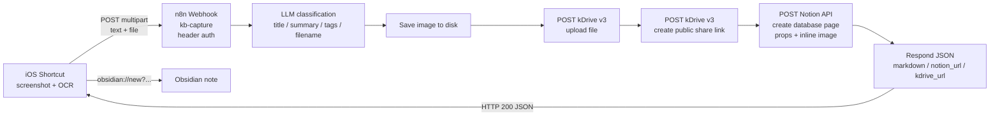

# n8n-kb-capture

Turn iOS screenshots into organized knowledge-base entries — an n8n pipeline that classifies, stores, and files a screenshot in Notion, then hands you back an `obsidian://new` URL.

**The pipeline:** an iOS Shortcut sends a screenshot + OCR text (multipart) to a self-hosted n8n webhook → an LLM classifies the content → the image is uploaded to Infomaniak kDrive with a public share link → a Notion database page is created with properties, the OCR text, and the image inline → the webhook replies with JSON that the Shortcut uses to open a new Obsidian note (`obsidian://new`).

## Architecture



## The workflow

[`workflow/kb-capture.json`](workflow/kb-capture.json) is a cleaned n8n export (no real credential ids) containing 9 nodes:

1. **Webhook** — `POST /kb-capture`, header auth (`X-KB-capture-token`)
2. **HTTP Request** — LLM chat completion with a strict JSON schema (`title`, `summary`, `tags`, `filename`)
3. **Edit Fields** — extracts `title` / `summary` / `tags` / `filename` (timestamp fallback)
4. **Save Image to Disk** — finds the uploaded image in the webhook item's binary properties (`data0`, `data1`, …), writes it to disk, and passes the binary downstream
5. **Upload to kDrive** — `POST https://api.infomaniak.com/3/drive/<DRIVE_ID>/upload`
6. **Create kDrive share link** — `POST …/files/{file_id}/link` with `right=public`
7. **Create a database page** — Notion page with properties + `blockUi` content blocks (OCR text paragraph + inline image)
8. **Edit Fields1** — assembles the final `markdown`, `notion_url`, `kdrive_url` payload
9. **Respond to Webhook1** — returns `200` with a JSON body to the Shortcut

## Requirements

- A self-hosted n8n instance with the public REST API enabled (you need an `N8N_SELFHOSTED_API_KEY` for the scripts).
- `N8N_DEFAULT_BINARY_DATA_MODE=default` — keep the default (on-disk binary storage). The **Save Image to Disk** node uses `fs` directly; virtual/filesystem modes have not been tested with it.
- A [Notion integration](https://www.notion.so/my-integrations) and a Notion database to write into.
- An Infomaniak kDrive with an API token.
- nginx (or any reverse proxy) in front of n8n with multipart body size raised — see below.

## Setup

### 1. Reverse proxy (nginx)

```nginx
server {
    listen 443 ssl;
    server_name n8n.example.com;

    # IMPORTANT: without this, multipart uploads > 1 MB fail with 413 Request Entity Too Large
    client_max_body_size 50M;

    location / {
        proxy_pass http://127.0.0.1:5678;
        proxy_http_version 1.1;
        proxy_set_header Host $host;
        proxy_set_header X-Real-IP $remote_addr;
        proxy_set_header X-Forwarded-For $proxy_add_x_forwarded_for;
        proxy_set_header X-Forwarded-Proto $scheme;
        proxy_set_header Upgrade $http_upgrade;
        proxy_set_header Connection "upgrade";
    }
}
```

### 2. Secrets / environment (never committed)

Create a `scripts/n8n.env` file (git-ignored):

```bash
N8N_SELFHOSTED_URL=https://n8n.example.com
N8N_SELFHOSTED_API_KEY=<your n8n public API key>
```

Create a `scripts/webhook_token.txt` file (git-ignored) containing the token the **Webhook** node expects in the `X-KB-capture-token` header.

The kDrive token and the Notion token are **not** in this repo — they live only as n8n credentials ("kDrive Upload Token", "Notion account").

`WEBHOOK_URL` is your instance's production webhook URL: `https://<your-n8n-host>/webhook/kb-capture`. Test executions use `/webhook-test/kb-capture` instead.

### 3. Import the workflow

1. In n8n: *Workflows* → *Import from file* → `workflow/kb-capture.json`.
2. **Re-attach credentials.** On import, n8n cannot resolve the original credentials — their `id`s are deliberately set to `REPLACE_ME` (names are kept for reference). In each node, select your own credential:
   - **Webhook** → header auth (`X-KB-capture-token`)
   - **HTTP Request** (LLM) → Bearer auth
   - **Upload to kDrive** / **Create kDrive share link** → header auth (kDrive token)
   - **Create a database page** → Notion API
3. Replace the placeholders in node parameters:
   - `<DRIVE_ID>` — your kDrive id (upload + share-link URLs)
   - `<DIRECTORY_ID>` — target kDrive directory id (`directory_id` query param)
   - `<INFOMANIAK_AI_PRODUCT_ID>` — Infomaniak AI product id (chat/completions URL)
   - `<NOTION_DATA_SOURCE_ID>` — id of your Notion database (data source)
   - `https://n8n.example.com` — your n8n instance URL (used in the inline image URL and the generated markdown)
4. Activate the workflow and note the `WEBHOOK_URL`.

### 4. Notion integration

- Create an integration at <https://www.notion.so/my-integrations> and copy the token.
- In n8n, create a **Notion API** credential with that token.
- Share the target database with the integration (database `···` menu → *Connections* → *Connect to*).
- Replace `<NOTION_DATA_SOURCE_ID>` in the **Create a database page** node with your database's data-source id (the UUID in the database URL).

### 5. kDrive API v3

- Create an API token in the Infomaniak manager → kDrive → *API*.
- In n8n, create a **Header Auth** credential (`Authorization: Bearer <token>`).
- Upload: `POST https://api.infomaniak.com/3/drive/<DRIVE_ID>/upload` with query params `directory_id`, `file_name`, `total_size`, `conflict=rename`.
  - ⚠️ `total_size` is in **bytes**, not KB/MB. The **Save Image to Disk** node computes it (`buf.length`) and passes it to the upload node — get this wrong and the upload fails.
- Share link: `POST https://api.infomaniak.com/2/drive/<DRIVE_ID>/files/<FILE_ID>/link` with body `{"right": "public", "can_download": true}`.

## Gotchas

These cost us real debugging time — read them before your first run:

### nginx 400: space before the colon in a header name

Never put a space before the `:` in an HTTP header name — `X-KB-capture-token: abc`, not `X-KB-capture-token : abc`. nginx follows RFC 7230 strictly and rejects the whole request with **`400 Bad Request`** and a tiny (~166-byte) HTML error page that is easy to miss in logs. This is a classic silent failure when building the request from an iOS Shortcut.

(Related but different: a space before the `:` in an nginx *config directive* — `client_max_body_size 50M;` — is a config syntax error: `nginx: [emerg] invalid parameter` on reload.)

### iOS Shortcuts: "Get Dictionary from Input" fails with "Rich Text to Dictionary"

The webhook's JSON response sometimes arrives in Shortcuts as Rich Text, and *Get Dictionary from Input* then errors with `Rich Text to Dictionary`. Workaround: insert a **Set Variable** (or *Text*) action between the HTTP response and *Get Dictionary from Input* to force coercion to plain text.

### URL-encode everything you put in `obsidian://new`

`#`, `&`, `?`, spaces, etc. break the URL if passed raw. In Shortcuts, run *URL Encode* on `<TITLE>` and `<MARKDOWN>` before injecting them into the URL template.

## iOS Shortcut

The Shortcut sends a `POST` multipart request to the webhook:

- Field **`text`**: the OCR text (from *Extract Text from Image*).
- Field **`file`**: the screenshot (`image/jpeg` or `image/png`).

The final n8n node answers `200` with a JSON body:

```json
{
  "title": "...",
  "markdown": "---\nsource: screenshot\n...\n",
  "notion_url": "https://notion.so/...",
  "kdrive_url": "https://...",
  "summary": "...",
  "ocr": "...",
  "filename": "...",
  "tags": ["..."]
}
```

Use it to build the note URL:

```
obsidian://new?vault=<VAULT>&name=<TITLE>&content=<MARKDOWN>
```

(with `<TITLE>` and `<MARKDOWN>` URL-encoded, per the gotcha above).

## Scripts

Python 3.10+ helpers in [`scripts/`](scripts/). They read secrets from git-ignored files (`n8n.env`, `webhook_token.txt`) — never from the code.

### `e2e_test.py`

End-to-end test: downloads a fresh test image, POSTs it multipart to the production webhook, prints the JSON response.

```bash
cd scripts
# put webhook_token.txt and n8n.env next to the script first
python e2e_test.py
```

### `apply_workflow.py`

Example of applying a targeted fix to a workflow through the n8n REST API. The target workflow id is read from the `N8N_WORKFLOW_ID` environment variable.

> **n8n quirk:** `PUT /api/v1/workflows/{id}` accepts a payload of `{name, nodes, connections, settings}` only — **no `versionId`, no `active`**. Including those fields returns an error.

```bash
cd scripts
N8N_WORKFLOW_ID=<your-workflow-id> python apply_workflow.py
```

### `n8n_common.py`

Shared helpers (loads `n8n.env`, wraps the n8n REST API). Imported by the two other scripts.

## Security

- **Never commit** tokens, API keys, passwords, or your real private instance URL.
- The included `.gitignore` excludes `*.env`, `webhook_token.txt`, `*.pem`, `*.key`, etc.
- All credential ids in the workflow JSON are replaced with `REPLACE_ME` — re-select them in the n8n UI after import.
- Instance URLs are replaced with `https://n8n.example.com`; kDrive/Notion ids with placeholders (`<DRIVE_ID>`, `<DIRECTORY_ID>`, `<NOTION_DATA_SOURCE_ID>`, `<INFOMANIAK_AI_PRODUCT_ID>`).

## License

[MIT](LICENSE) — Bruno CoCH
