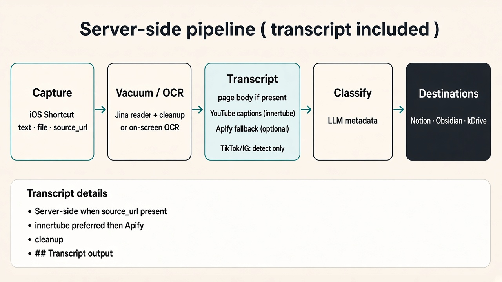
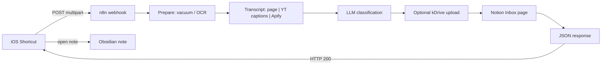

# n8n-kb-capture

**Save an article you read online — or an interesting social post — into Notion and Obsidian.**

One tap from your phone. You get:

- A note with a **link back to the source** (when available)
- **Full text** when the site/app can share it — or what was **on screen** from a screenshot
- **Transcript** for video posts when captions or page text are available (server-side)
- Optional screenshot file storage
- Organized fields: topics, author, medium (where it came from), format

**Who it’s for:** anyone who saves stuff from the phone and wants it in a real knowledge base — not a pile of screenshots.

**How it feels:** copy a link or share a page → run the Shortcut → a note appears in Notion and Obsidian.

---

## Two ways to launch (read this first)

How you start the Shortcut changes **what gets captured**.

| | **A — Side button / direct (recommended)** | **B — Share Sheet** |
|---|---|---|
| **UX** | One tap → takes a **screenshot** | Share → Shortcut |
| **Result** | Content from **what you see** on screen (OCR) | The **full article/post** as the site/app shares it (and/or URL → full-text reader) |
| **Best for** | Speed; social posts, cards, what’s visible now | Long articles when you need the complete text |
| **Trade-off** | May miss text below the fold | Slightly more steps; fuller capture |

**Recommended default:** side button for speed. Use **Share** when you need the whole article, not just what’s on screen.

Both paths can land in **Notion + Obsidian**, with a source link when available. If `source_url` is sent (Share, or clipboard URL on the side-button path), the server may also attach a **transcript** — the Shortcut usually needs no change for that.


<details>
<summary>SVG version (crisper labels)</summary>


</details>

### Pipeline (including transcript)

After capture, n8n runs vacuum/OCR, then optional transcript extraction, then classification, then Notion / Obsidian / optional kDrive:



<details>
<summary>SVG version (crisper labels)</summary>


</details>

### 60-second demo (YouTube Short)

[](https://www.youtube.com/shorts/_3NTB-Vg0RA)

This video shows the **side-button / screenshot** case only (OCR of what you see on screen) — not the Share Sheet path that pulls the full article from the site, and not the server-side transcript step.

*Side button = what’s on screen · Share = full article — [watch the Short](https://www.youtube.com/shorts/_3NTB-Vg0RA)*

---

## How to use this repo (build your own automation)

Skill-gradient friendly path: fork or clone this repo, wire credentials, deploy, then rebuild the iOS Shortcut from the checklist below. French Shortcuts UI labels are in parentheses where helpful.

### Overview of steps

1. **Import** [`workflow/kb-capture.json`](workflow/kb-capture.json) into your n8n instance (*Import from file*).
2. **Attach credentials** wherever you see `REPLACE_ME` (Webhook header auth, LLM Bearer, optional kDrive header auth, Notion API).
3. **Set the webhook URL** you’ll call from the phone: `https://YOUR-N8N/webhook/kb-capture` (test path: `/webhook-test/kb-capture`).
4. **Prepare a Notion Inbox database** with at least: Title, Summary, **Tags** (topics only), **Author**, **Medium**, **Format**, Source, URL (plus optional Text / Files & media). Share the DB with your Notion integration.
5. **Optional:** Infomaniak kDrive for screenshot upload + public share links (`<DRIVE_ID>`, `<DIRECTORY_ID>` placeholders in the workflow).
6. **Optional (YouTube transcripts):** set `APIFY_TOKEN` in the n8n host env (e.g. `/home/ubuntu/n8n/.env`) so the Apify fallback can run when native captions are missing — see [Transcripts](#transcripts).
7. **Deploy n8n** behind a public HTTPS reverse proxy (raise multipart body size — see [Setup](#setup-technical) below).
8. **Build the iOS Shortcut** (one Shortcut + IF for both Share and side-button paths) using the checklist.

### iOS Shortcut — rebuild checklist

Create **one** Shortcut that handles both launch modes with an **If** (*Si*).

#### Shortcut settings

1. Name the Shortcut (e.g. `KB Capture`).
2. Enable **Show in Share Sheet** (*Afficher dans la feuille de partage*).
3. Accepted types: **URLs**, **Text**, **Images** (*URL*, *Texte*, *Images*).
4. Assign it to the **Action Button** / side button (*Bouton Action*) if you want the direct / screenshot path.

#### Branch: Share vs side button

5. **If** (*Si*): **URLs from Shortcut Input** (*URL du contenu du Raccourci*) **has any value** (*a une valeur*) → **Share path**; **Otherwise** (*Sinon*) → **Side-button path**.

#### Share path (true branch)

6. **Get URLs from Input** (*Obtenir les URL du contenu d’entrée*) → store as variable `source_url`.
7. **Get Text from Input** (*Obtenir le texte du contenu d’entrée*) → store as variable `text`.
8. Optionally **Get Images from Input** (*Obtenir les images…*) if the share includes an image → variable `file`.

#### Side-button path (false / Otherwise branch)

9. **Take Screenshot** (*Prendre une capture d’écran*) → variable `file` (the screenshot).
10. **Extract Text from Image** (*Extraire le texte de l’image*) on that screenshot → variable `text` (OCR).
11. **Get Clipboard** (*Obtenir le presse-papiers*).
12. Optionally: if the clipboard is a URL, set `source_url` from it (else leave empty).

#### Common path (after the If / merge)

13. Ensure variables exist: `text`, `file` (screenshot or shared image; may be empty), `source_url` (may be empty).
14. **Get Contents of URL** (*Obtenir le contenu de l’URL*):
    - Method: **POST**
    - URL: `https://YOUR-N8N/webhook/kb-capture`
    - Headers: `X-KB-capture-token` = your token (**no space before `:`** — see [Gotchas](#gotchas))
    - Request body: **Form** (*Formulaire*) with fields:
      - `text` → variable `text`
      - `file` → variable `file` (file / image)
      - `source_url` → variable `source_url`
15. **Get Dictionary from Input** (*Obtenir un dictionnaire du contenu d’entrée*) — JSON parse workaround if the response is treated as Rich Text; if it fails, insert **Text** / **Set Variable** first (see [Gotchas](#gotchas)).
16. **Get Dictionary Value** (*Obtenir la valeur du dictionnaire*) for at least:
    - `filename` (note title)
    - `markdown` (note body)
    - optionally `notion_url`, `source_url`, `transcript_ok`
17. **URL Encode** (*Encoder en URL*) the markdown (and the title/filename if needed).
18. Build a **Text** / **URL** for the Obsidian deep link, e.g. `obsidian://new?vault=YOUR_VAULT&name=ENCODED_TITLE&content=ENCODED_MARKDOWN`.
19. **Open URL** (*Ouvrir l’URL*) → creates/opens the note in Obsidian.
20. Optional for debug: **Show Result** (*Afficher le résultat*) or **Show Alert** (*Afficher une alerte*) with `notion_url` / errors.

> Reminder: the [YouTube Short](https://www.youtube.com/shorts/_3NTB-Vg0RA) demos the **screenshot / side-button** path only — not Share. Transcripts are fetched on the server when `source_url` is present.

### n8n nodes in this workflow

Exact names from [`workflow/kb-capture.json`](workflow/kb-capture.json):

| # | Node | Role |
|---|------|------|
| 1 | **Webhook** | Receives multipart `POST` (`text`, `file`, `source_url`) with header auth |
| 2 | **Prepare Capture** | Normalizes inputs; Jina URL vacuum / reader; cleanup; **transcript** (page / YouTube / Apify) |
| 3 | **Classify LLM** | HTTP call to the LLM → title, summary, tags, author, medium, format, filename |
| 4 | **Edit Fields -1** | Polishes topics; keeps Tags = topics only; derives medium when useful |
| 5 | **Has Image?** | Branches: with screenshot vs text/URL only |
| 6 | **Save Image to Disk** | Writes the uploaded image to a temp path (image branch) |
| 7 | **Upload to kDrive** | Uploads the screenshot (optional; needs kDrive creds) |
| 8 | **Create kDrive share link** | Public share URL for the file |
| 9 | **Enrich With Media** | Sets fields including `kdrive_url` when an image was stored |
| 10 | **Enrich Without Media** | Same enrichment without media URLs |
| 11 | **Notion Path?** | Chooses Notion create with vs without attached file |
| 12 | **Create Notion (with image)** | Creates the Inbox page + file attachment |
| 13 | **Create Notion (no image)** | Creates the Inbox page without a file |
| 14 | **Build Response** | Assembles Obsidian front-matter + markdown JSON for the Shortcut |
| 15 | **Respond to Webhook1** | Returns JSON (`filename`, `markdown`, `notion_url`, `transcript_ok`, …) |

### Use an AI assistant

You do **not** need to be an n8n or Shortcuts expert. It is normal — and encouraged — to paste this README plus `workflow/kb-capture.json` into **Cursor**, **ChatGPT**, or **Claude** and ask it to:

- Map your Notion property names to the workflow (Tags = topics only; **Medium** not “Outlet”; Author; Format; URL)
- Fix iOS Shortcuts errors (Rich Text → Dictionary, header colon spacing, Form field names)
- Swap placeholders for your webhook URL and token (keep secrets out of chat when you can)
- Wire `APIFY_TOKEN` for the optional YouTube transcript fallback
- Read a failed n8n execution and suggest the next fix

Treat the assistant as a pair-programmer for the fiddly bits; you still own credentials and deploy.

---

## What you get (power-user overview)

### Dual entry on iPhone

1. **Action Button / side button (direct)** — screenshot of what you see; optional clipboard URL if you copied a link first (source + possible extra full-text “vacuum” + transcript).
2. **Share Sheet** — receives what the site/app shares; best path for complete article/post text (and the usual path that already sends `source_url`).

Transcripts are **server-side**. If the Shortcut already posts `source_url`, you typically do not need to change it for captions.

### Faceted metadata (not everything in Tags)

| Field | Meaning | Examples |
|-------|---------|----------|
| **Tags** | Topics / subjects **only** | literature, tech, AI, cinema |
| **Author** | Who created it | J.J. Abrams |
| **Medium** | Concrete channel / outlet (not named “Outlet”) | NYT, Wired, `@instagram.handle` |
| **Format** | Optional typology | article, post, video, podcast |

`source_url` is the canonical link — kept separate from tags.

### Requirements (high level)

- Self-hosted **n8n** (public webhook + REST API for the helper scripts)
- A **Notion** database (Inbox) with properties: Title, Summary, Tags, Author, Medium, Format, Source, URL, …
- Optional **Infomaniak kDrive** for screenshot files + public share links
- Optional **`APIFY_TOKEN`** on the n8n host for YouTube transcript fallback when native captions are missing
- iOS Shortcuts for the two launch modes
- Reverse proxy (e.g. nginx) with a raised multipart body size

---

## Transcripts

When `source_url` is present, **Prepare Capture** may attach spoken/caption text. Order of preference:

1. **Already on the page** — if the Jina vacuum / post body already contains a usable transcript section or dialogue-like block, reuse it (`transcript_source` like `page_section` / `page_dialogue`).
2. **YouTube native captions** — preferred path via YouTube **innertube** timedtext (`transcript_source`: `youtube_innertube`).
3. **Apify fallback** — if captions are missing, call Actor `pintostudio/youtube-transcript-scraper` (`transcript_source`: `apify_pintostudio`). Needs `APIFY_TOKEN` in the n8n environment (self-hosters often put it in `/home/ubuntu/n8n/.env` and restart the container so `$env.APIFY_TOKEN` is visible). Never commit the token.

**Platform notes**

- **YouTube** — full path: page detect → innertube → optional Apify.
- **TikTok / Instagram** — platform is detected; transcript fetch is YouTube-oriented (no Apify path for those today).

**Cleaning**

- Strip fake YouTube UI “Transcript” chrome that sometimes lands in vacuum text
- Dedupe rolling / consecutive caption duplicates
- Prefer **Description** (not UI chrome) for Contenu-style body text
- Notion fields are length-capped (body + `## Transcript` stay within Notion rich-text limits)

**Output**

- Notion page Contenu / Text and Obsidian `markdown` include a `## Transcript` section when `transcript_ok` is true
- Webhook JSON includes `transcript_ok` (boolean) and `transcript_source` (string)

---

## Architecture (technical)



[`workflow/kb-capture.json`](workflow/kb-capture.json) is a **sanitized** n8n export (credential ids → `REPLACE_ME`, instance URL → `n8n.example.com`).

Main stages:

1. **Webhook** — `POST /kb-capture`, header auth (`X-KB-capture-token`)
2. **Prepare Capture** — normalizes `text` / `source_url` / image; optional Jina reader vacuum; cookie/junk cleanup; **transcript** (page / innertube / Apify)
3. **Classify LLM** — JSON schema: `title`, `summary`, `tags`, `author`, `medium`, `format`, `filename`
4. **Edit Fields -1** — polish topics; strip author/medium/format out of Tags; derive medium from URL when useful
5. **Has Image?** — with image → save + kDrive; without → Notion-only path
6. **Create Notion** — properties including **Author**, **Medium**, **Format**; Tags = topics only; Contenu may include `## Transcript`
7. **Build Response** — Obsidian front-matter (`author`, `medium`, `format`, `tags`, `source`) + markdown body (with `## Transcript` when present)
8. **Respond to Webhook** — JSON for the Shortcut (`transcript_ok`, `transcript_source`, …)

### Webhook contract

Multipart `POST` fields:

| Field | Required | Role |
|-------|----------|------|
| `text` | often | OCR / shared text / caption |
| `file` | optional | Screenshot image |
| `source_url` | optional | Canonical URL → source link + reader vacuum + transcript when possible |

Auth header: `X-KB-capture-token: <token>` (exact header name; **no space before `:`**).

Example response shape:

```json
{
  "title": "...",
  "markdown": "---\nsource: https://...\nauthor: \"...\"\nmedium: \"YouTube\"\nformat: \"video\"\ntags:\n  - ...\n---\n...\n\n## Transcript\n\n...",
  "notion_url": "https://www.notion.so/...",
  "kdrive_url": "https://...",
  "source_url": "https://...",
  "vacuum_ok": true,
  "transcript_ok": true,
  "transcript_source": "youtube_innertube",
  "summary": "...",
  "tags": ["literature", "design"],
  "author": "...",
  "medium": "YouTube",
  "format": "video"
}
```

### Vacuum / reader + cleanup

When `source_url` is present, the workflow may fetch readable full text via a reader endpoint (Jina), then:

- Strip scripts/styles/HTML noise
- Unwrap strikethrough / cookie-banner junk
- Prefer cleaned text for the LLM and the note body
- Run transcript detection / fetch as described in [Transcripts](#transcripts)

Tags stay **topical**; medium/author/format stay in their own fields.

---

## Setup (technical)

### 1. Reverse proxy (nginx)

```nginx
server {
    listen 443 ssl;
    server_name n8n.example.com;

    # Without this, multipart uploads > 1 MB often fail with 413
    client_max_body_size 50M;

    location / {
        proxy_pass http://127.0.0.1:5678;
        proxy_http_version 1.1;
        proxy_set_header Host $host;
        proxy_set_header X-Real-IP $remote_addr;
        proxy_set_header X-Forwarded-For $proxy_add_x_forwarded_for;
        proxy_set_header X-Forwarded-Proto $scheme;
        proxy_set_header Upgrade $http_upgrade;
        proxy_set_header Connection "upgrade";
    }
}
```

### 2. Secrets / environment (never committed)

Create `scripts/n8n.env` (git-ignored):

```bash
N8N_SELFHOSTED_URL=https://n8n.example.com
N8N_SELFHOSTED_API_KEY=<your n8n public API key>
```

Create `scripts/webhook_token.txt` (git-ignored) with the Webhook header token.

kDrive and Notion tokens live only as **n8n credentials**, not in this repo.

For the optional YouTube Apify fallback, set on the **n8n host** (not in this repo), for example in `/home/ubuntu/n8n/.env`:

```bash
APIFY_TOKEN=<your Apify API token>
```

Restart n8n so the Code node can read `$env.APIFY_TOKEN`. Without it, innertube / page detection still run; only the Apify fallback is skipped.

Production webhook: `https://<your-n8n-host>/webhook/kb-capture`  
Test: `/webhook-test/kb-capture`

### 3. Import the workflow

1. n8n → *Workflows* → *Import from file* → `workflow/kb-capture.json`
2. Re-attach credentials (`id`s are `REPLACE_ME`): Webhook header auth, LLM Bearer, kDrive header auth, Notion API
3. Replace placeholders: `<DRIVE_ID>`, `<DIRECTORY_ID>`, `<INFOMANIAK_AI_PRODUCT_ID>`, `<NOTION_DATA_SOURCE_ID>`, `https://n8n.example.com`
4. Activate and note the webhook URL

### 4. Notion database properties

Share your Inbox database with the Notion integration, then ensure properties exist:

| Property | Type |
|----------|------|
| Title | title |
| Summary | rich_text |
| Tags | multi_select (**topics only**) |
| Author | rich_text |
| Medium | rich_text |
| Format | select (e.g. article, post, vidéo, podcast, …) |
| Source | select (e.g. iOS Screenshot / Share Sheet) |
| Created | date |
| Text | rich_text |
| URL | url |
| Files & media | files (optional) |

### 5. kDrive API (optional, for screenshots)

- Upload: `POST https://api.infomaniak.com/3/drive/<DRIVE_ID>/upload` — `total_size` is in **bytes**
- Share link: `POST …/files/{id}/link` with `right=public`

---

## Gotchas

### nginx 400: space before `:` in a header name

Use `X-KB-capture-token: abc`, never `X-KB-capture-token : abc`. nginx returns a tiny HTML **400** that is easy to miss.

### iOS Shortcuts: Rich Text → Dictionary

If *Get Dictionary from Input* fails on the webhook JSON, insert **Set Variable** / *Text* first to coerce plain text.

### URL-encode Obsidian deep links

Encode title and markdown before building `obsidian://new?vault=…&name=…&content=…`.

### Apify fallback silent skip

If `transcript_source` never becomes `apify_pintostudio` on caption-less videos, check that `APIFY_TOKEN` is set in the n8n container env (not only on the host shell).

---

## iOS Shortcuts (summary)

**Direct / side button:** screenshot (+ optional clipboard URL as `source_url`) + OCR text → multipart POST.

**Share:** shared URL/text (± image) → multipart POST with `source_url` / `text`.

Open the returned note, for example:

```
obsidian://new?vault=<VAULT>&name=<TITLE>&content=<MARKDOWN>
```

(with URL-encoded `<TITLE>` and `<MARKDOWN>`).

---

## Scripts

Python 3.10+ helpers in [`scripts/`](scripts/). Secrets from git-ignored `n8n.env` / `webhook_token.txt` only.

| Script | Purpose |
|--------|---------|
| `e2e_test.py` | POST a sample capture to the production webhook |
| `apply_workflow.py` | Example surgical PUT via n8n REST API |
| `n8n_common.py` | Shared API helpers |

Use `e2e_test.py` for a basic webhook smoke test. For transcript coverage, POST a YouTube `source_url` and check `transcript_ok` / `transcript_source` in the JSON (and `## Transcript` in `markdown`). The Apify path is optional and only exercises when native captions are missing and `APIFY_TOKEN` is set.

> **n8n quirk:** `PUT /api/v1/workflows/{id}` accepts `{name, nodes, connections, settings}` only — **no `versionId`, no `active`**.

```bash
cd scripts
python e2e_test.py
N8N_WORKFLOW_ID=<your-workflow-id> python apply_workflow.py
```

---

## Security

- Never commit tokens, API keys, or your real private instance URL.
- Credential ids in the workflow JSON are `REPLACE_ME`.
- Instance host is `n8n.example.com`; Notion/kDrive ids are placeholders.
- Keep `APIFY_TOKEN` only in the n8n host env (e.g. `/home/ubuntu/n8n/.env`), never in this repo.

## License

[MIT](LICENSE) — Bruno CoCH
