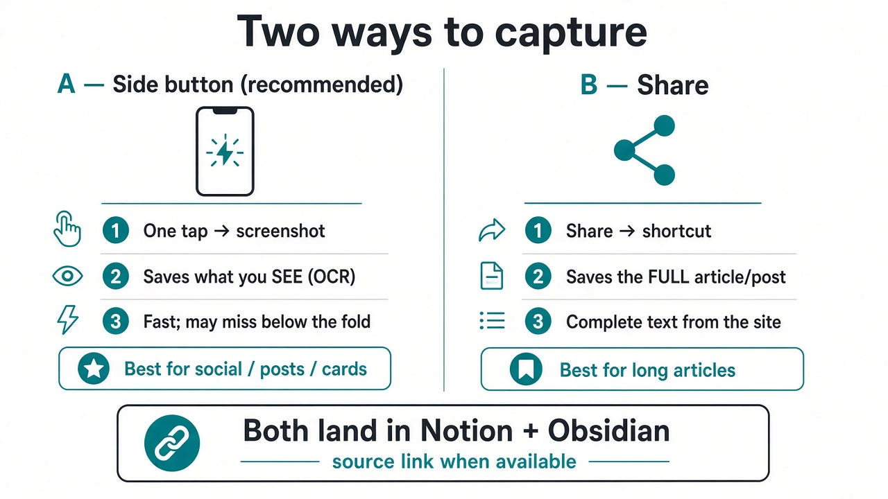
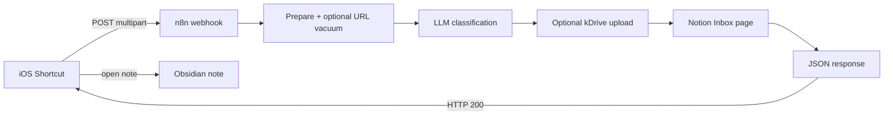

# n8n-kb-capture

**Save an article you read online — or an interesting social post — into Notion and Obsidian.**

One tap from your phone. You get:

- A note with a **link back to the source** (when available)
- **Full text** when the site/app can share it — or what was **on screen** from a screenshot
- Optional screenshot file storage
- Organized fields: topics, author, medium (where it came from), format

**Who it’s for:** anyone who saves stuff from the phone and wants it in a real knowledge base — not a pile of screenshots.

**How it feels:** copy a link or share a page → run the Shortcut → a note appears in Notion and Obsidian.

---

## Two ways to launch (read this first)

How you start the Shortcut changes **what gets captured**.

| | **A — Side button / direct (recommended)** | **B — Share Sheet** |
|---|---|---|
| **UX** | One tap → takes a **screenshot** | Share → Shortcut |
| **Result** | Content from **what you see** on screen (OCR) | The **full article/post** as the site/app shares it (and/or URL → full-text reader) |
| **Best for** | Speed; social posts, cards, what’s visible now | Long articles when you need the complete text |
| **Trade-off** | May miss text below the fold | Slightly more steps; fuller capture |

**Recommended default:** side button for speed. Use **Share** when you need the whole article, not just what’s on screen.

Both paths can land in **Notion + Obsidian**, with a source link when available.



<details>
<summary>SVG version (crisper labels)</summary>


</details>

### 60-second demo (YouTube Short)

[](https://www.youtube.com/shorts/_3NTB-Vg0RA)

This video shows the **side-button / screenshot** case only (OCR of what you see on screen) — not the Share Sheet path that pulls the full article from the site.

*Side button = what’s on screen · Share = full article — [watch the Short](https://www.youtube.com/shorts/_3NTB-Vg0RA)*

---

## What you get (power-user overview)

### Dual entry on iPhone

1. **Action Button / side button (direct)** — screenshot of what you see; optional clipboard URL if you copied a link first (source + possible extra full-text “vacuum”).
2. **Share Sheet** — receives what the site/app shares; best path for complete article/post text.

### Faceted metadata (not everything in Tags)

| Field | Meaning | Examples |
|-------|---------|----------|
| **Tags** | Topics / subjects **only** | literature, tech, AI, cinema |
| **Author** | Who created it | J.J. Abrams |
| **Medium** | Concrete channel / outlet (not named “Outlet”) | NYT, Wired, `@instagram.handle` |
| **Format** | Optional typology | article, post, video, podcast |

`source_url` is the canonical link — kept separate from tags.

### Requirements (high level)

- Self-hosted **n8n** (public webhook + REST API for the helper scripts)
- A **Notion** database (Inbox) with properties: Title, Summary, Tags, Author, Medium, Format, Source, URL, …
- Optional **Infomaniak kDrive** for screenshot files + public share links
- iOS Shortcuts for the two launch modes
- Reverse proxy (e.g. nginx) with a raised multipart body size

---

## Architecture (technical)



[`workflow/kb-capture.json`](workflow/kb-capture.json) is a **sanitized** n8n export (credential ids → `REPLACE_ME`, instance URL → `n8n.example.com`).

Main stages:

1. **Webhook** — `POST /kb-capture`, header auth (`X-KB-capture-token`)
2. **Prepare Capture** — normalizes `text` / `source_url` / image; optional reader vacuum; cookie/junk cleanup
3. **Classify LLM** — JSON schema: `title`, `summary`, `tags`, `author`, `medium`, `format`, `filename`
4. **Edit Fields** — polish topics; strip author/medium/format out of Tags; derive medium from URL when useful
5. **Has Image?** — with image → save + kDrive; without → Notion-only path
6. **Create Notion** — properties including **Author**, **Medium**, **Format**; Tags = topics only
7. **Build Response** — Obsidian front-matter (`author`, `medium`, `format`, `tags`, `source`) + markdown body
8. **Respond to Webhook** — JSON for the Shortcut

### Webhook contract

Multipart `POST` fields:

| Field | Required | Role |
|-------|----------|------|
| `text` | often | OCR / shared text / caption |
| `file` | optional | Screenshot image |
| `source_url` | optional | Canonical URL → source link + reader vacuum when possible |

Auth header: `X-KB-capture-token: <token>` (exact header name; **no space before `:`**).

Example response shape:

```json
{
  "title": "...",
  "markdown": "---\nsource: https://...\nauthor: \"...\"\nmedium: \"New Yorker\"\nformat: \"article\"\ntags:\n  - literature\n---\n...",
  "notion_url": "https://www.notion.so/...",
  "kdrive_url": "https://...",
  "source_url": "https://...",
  "vacuum_ok": true,
  "summary": "...",
  "tags": ["literature", "design"],
  "author": "...",
  "medium": "New Yorker",
  "format": "article"
}
```

### Vacuum / reader + cleanup

When `source_url` is present, the workflow may fetch readable full text via a reader endpoint, then:

- Strip scripts/styles/HTML noise
- Unwrap strikethrough / cookie-banner junk
- Prefer cleaned text for the LLM and the note body

Tags stay **topical**; medium/author/format stay in their own fields.

---

## Setup (technical)

### 1. Reverse proxy (nginx)

```nginx
server {
    listen 443 ssl;
    server_name n8n.example.com;

    # Without this, multipart uploads > 1 MB often fail with 413
    client_max_body_size 50M;

    location / {
        proxy_pass http://127.0.0.1:5678;
        proxy_http_version 1.1;
        proxy_set_header Host $host;
        proxy_set_header X-Real-IP $remote_addr;
        proxy_set_header X-Forwarded-For $proxy_add_x_forwarded_for;
        proxy_set_header X-Forwarded-Proto $scheme;
        proxy_set_header Upgrade $http_upgrade;
        proxy_set_header Connection "upgrade";
    }
}
```

### 2. Secrets / environment (never committed)

Create `scripts/n8n.env` (git-ignored):

```bash
N8N_SELFHOSTED_URL=https://n8n.example.com
N8N_SELFHOSTED_API_KEY=<your n8n public API key>
```

Create `scripts/webhook_token.txt` (git-ignored) with the Webhook header token.

kDrive and Notion tokens live only as **n8n credentials**, not in this repo.

Production webhook: `https://<your-n8n-host>/webhook/kb-capture`  
Test: `/webhook-test/kb-capture`

### 3. Import the workflow

1. n8n → *Workflows* → *Import from file* → `workflow/kb-capture.json`
2. Re-attach credentials (`id`s are `REPLACE_ME`): Webhook header auth, LLM Bearer, kDrive header auth, Notion API
3. Replace placeholders: `<DRIVE_ID>`, `<DIRECTORY_ID>`, `<INFOMANIAK_AI_PRODUCT_ID>`, `<NOTION_DATA_SOURCE_ID>`, `https://n8n.example.com`
4. Activate and note the webhook URL

### 4. Notion database properties

Share your Inbox database with the Notion integration, then ensure properties exist:

| Property | Type |
|----------|------|
| Title | title |
| Summary | rich_text |
| Tags | multi_select (**topics only**) |
| Author | rich_text |
| Medium | rich_text |
| Format | select (e.g. article, post, vidéo, podcast, …) |
| Source | select (e.g. iOS Screenshot / Share Sheet) |
| Created | date |
| Text | rich_text |
| URL | url |
| Files & media | files (optional) |

### 5. kDrive API (optional, for screenshots)

- Upload: `POST https://api.infomaniak.com/3/drive/<DRIVE_ID>/upload` — `total_size` is in **bytes**
- Share link: `POST …/files/{id}/link` with `right=public`

---

## Gotchas

### nginx 400: space before `:` in a header name

Use `X-KB-capture-token: abc`, never `X-KB-capture-token : abc`. nginx returns a tiny HTML **400** that is easy to miss.

### iOS Shortcuts: Rich Text → Dictionary

If *Get Dictionary from Input* fails on the webhook JSON, insert **Set Variable** / *Text* first to coerce plain text.

### URL-encode Obsidian deep links

Encode title and markdown before building `obsidian://new?vault=…&name=…&content=…`.

---

## iOS Shortcuts (summary)

**Direct / side button:** screenshot (+ optional clipboard URL as `source_url`) + OCR text → multipart POST.

**Share:** shared URL/text (± image) → multipart POST with `source_url` / `text`.

Open the returned note, for example:

```
obsidian://new?vault=<VAULT>&name=<TITLE>&content=<MARKDOWN>
```

(with URL-encoded `<TITLE>` and `<MARKDOWN>`).

---

## Scripts

Python 3.10+ helpers in [`scripts/`](scripts/). Secrets from git-ignored `n8n.env` / `webhook_token.txt` only.

| Script | Purpose |
|--------|---------|
| `e2e_test.py` | POST a sample capture to the production webhook |
| `apply_workflow.py` | Example surgical PUT via n8n REST API |
| `n8n_common.py` | Shared API helpers |

> **n8n quirk:** `PUT /api/v1/workflows/{id}` accepts `{name, nodes, connections, settings}` only — **no `versionId`, no `active`**.

```bash
cd scripts
python e2e_test.py
N8N_WORKFLOW_ID=<your-workflow-id> python apply_workflow.py
```

---

## Security

- Never commit tokens, API keys, or your real private instance URL.
- Credential ids in the workflow JSON are `REPLACE_ME`.
- Instance host is `n8n.example.com`; Notion/kDrive ids are placeholders.

## License

[MIT](LICENSE) — Bruno CoCH
