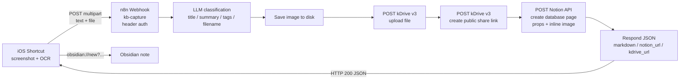

# n8n-kb-capture

*English intro:* **n8n-kb-capture** turns iOS screenshots into organized knowledge-base entries. An iOS Shortcut sends a screenshot + OCR text to a self-hosted n8n webhook; an LLM classifies the content; the image is uploaded to Infomaniak kDrive with a public share link; a Notion database page is created with properties, the OCR text, and the image inline; the webhook replies with JSON that the Shortcut uses to open an Obsidian note (`obsidian://new`).

*Version française :*

**n8n-kb-capture** transforme des captures d'écran iOS en notes de base de connaissances. Un raccourci iOS envoie (multipart) le texte OCR + l'image vers un webhook n8n self-hosted ; un LLM classifie le contenu ; l'image est envoyée sur kDrive (Infomaniak) avec un lien de partage public ; une page Notion est créée avec les propriétés, l'OCR et l'image inline ; le webhook répond en JSON que le raccourci utilise pour ouvrir une note Obsidian (`obsidian://new`).

## Architecture



## Workflow

Le fichier [`workflow/kb-capture.json`](workflow/kb-capture.json) est un export n8n nettoyé (sans identifiants réels) contenant 9 nœuds :

1. **Webhook** (`POST /kb-capture`, header auth)
2. **HTTP Request** — appel LLM (chat completions, JSON schema strict)
3. **Edit Fields** — extraction `title` / `summary` / `tags` / `filename` (fallback timestamp)
4. **Save Image to Disk** — retrouve le binaire image (`data0`, `data1`, …), écrit sur disque, repasse le binaire au nœud suivant
5. **Upload to kDrive** — `POST https://api.infomaniak.com/3/drive/<DRIVE_ID>/upload`
6. **Create kDrive share link** — `POST …/files/{id}/link` avec `right=public`
7. **Create a database page** — page Notion avec propriétés + blocs `blockUi` (texte OCR + image inline)
8. **Edit Fields1** — assemble `markdown`, `notion_url`, `kdrive_url`
9. **Respond to Webhook1** — répond `200` en JSON au raccourci

## Installation

### 1. Prérequis n8n (self-hosted)

- n8n en self-hosted avec accès API publique (`N8N_SELFHOSTED_API_KEY`).
- Binaire persistant : garder `N8N_DEFAULT_BINARY_DATA_MODE=default` (écriture disque, pas de filesystem mode virtuel — le nœud « Save Image to Disk » utilise `fs`).
- Reverse proxy nginx devant n8n :

```nginx
server {
    listen 443 ssl;
    server_name n8n.example.com;

    # IMPORTANT : sinon les uploads multipart > 1 Mo échouent (413 Request Entity Too Large)
    client_max_body_size 50M;

    location / {
        proxy_pass http://127.0.0.1:5678;
        proxy_http_version 1.1;
        proxy_set_header Host $host;
        proxy_set_header X-Real-IP $remote_addr;
        proxy_set_header X-Forwarded-For $proxy_add_x_forwarded_for;
        proxy_set_header X-Forwarded-Proto $scheme;
        proxy_set_header Upgrade $http_upgrade;
        proxy_set_header Connection "upgrade";
    }
}
```

> **Gotcha en-têtes (HTTP 400)** : jamais d'espace avant le `:` dans un en-tête HTTP — `X-KB-capture-token: abc` et non `X-KB-capture-token : abc`. nginx est strict (RFC 7230) et répond **`400 Bad Request`** à toute requête dont un en-tête contient un espace avant le deux-points (cause classique d'échec silencieux du raccourci iOS). Dans la config nginx elle-même, un espace avant le `:` d'une directive (`client_max_body_size 50M;`) provoque de son côté `nginx: [emerg] invalid parameter` au reload.

> **kDrive API v3** : le paramètre `total_size` est en **octets** (bytes), pas en Ko/Mo. Le nœud « Save Image to Disk » le calcule (`buf.length`) et le passe au nœud upload.

### 2. Variables d'environnement / secrets

Créer un fichier `scripts/n8n.env` (git-ignoré) :

```bash
N8N_SELFHOSTED_URL=https://n8n.example.com
N8N_SELFHOSTED_API_KEY=<votre clé API n8n>
```

Créer un fichier `scripts/webhook_token.txt` (git-ignoré) contenant le token attendu par le nœud « Webhook » (header `X-KB-capture-token`).

Le token kDrive et le token Notion ne sont **pas** dans ce repo — ils vivent uniquement comme credentials n8n (« kDrive Upload Token », « Notion account »).

### 3. Importer le workflow

1. n8n → *Workflows* → *Import from file* → `workflow/kb-capture.json`.
2. **Ré-attacher les credentials** : à l'import, n8n ne peut pas retrouver les credentials d'origine (les `id` sont volontairement `REPLACE_ME`). Dans chaque nœud concerné, sélectionner :
   - **Webhook** → header auth (`X-KB-capture-token`)
   - **HTTP Request** (LLM) → Bearer auth
   - **Upload to kDrive** / **Create kDrive share link** → header auth (token kDrive)
   - **Create a database page** → Notion API
3. Renseigner les placeholders dans les nœuds :
   - `<DRIVE_ID>` (kDrive), `<DIRECTORY_ID>` (dossier kDrive cible), `<INFOMANIAK_AI_PRODUCT_ID>` (produit IA Infomaniak), `<NOTION_DATA_SOURCE_ID>` (id de la base Notion), `https://n8n.example.com` (votre instance n8n).
4. Activer le workflow et noter l'URL webhook (`WEBHOOK_URL` = `https://<votre-n8n>/webhook/kb-capture`).

### 4. Intégration Notion

- Créer une *integration* sur <https://www.notion.so/my-integrations> et récupérer le token.
- Dans n8n, créer un credential **Notion API** avec ce token.
- Partager la base cible avec l'integration (bouton `···` → *Connections* → *Connect to*).
- Remplacer `<NOTION_DATA_SOURCE_ID>` dans le nœud « Create a database page » par l'id de la data source (l'UUID dans l'URL de la base).

### 5. kDrive API v3

- Créer un token sur <https://manager.infomaniak.com> → kDrive → *API*.
- Dans n8n, créer un credential **Header Auth** (`Authorization: Bearer <token>`).
- L'upload se fait sur `https://api.infomaniak.com/3/drive/<DRIVE_ID>/upload` avec les query params `directory_id`, `file_name`, `total_size` (en octets), `conflict=rename`.
- Le lien de partage se crée sur `https://api.infomaniak.com/2/drive/<DRIVE_ID>/files/<FILE_ID>/link` avec le body `{"right": "public", "can_download": true}`.

## Raccourci iOS

Le raccourci envoie une requête `POST` multipart vers le webhook :

- Champ **`text`** : le texte OCR (obtenu via *Extract Text from Image*).
- Champ **`file`** : l'image (`image/jpeg` ou `image/png`).

### Parser la réponse

Le nœud final n8n renvoie un JSON (`title`, `markdown`, `notion_url`, `kdrive_url`, `summary`, `ocr`, `filename`, `tags`). Dans Raccourcis, l'action *Get Dictionary from Input* échoue parfois avec l'erreur `Rich Text to Dictionary` — contournement : insérer une action **Set Variable** (ou *Text*) entre la réponse HTTP et *Get Dictionary from Input* pour forcer la coercion en texte brut.

### Ouvrir Obsidian

Construire l'URL `obsidian://new` avec encodage URL des valeurs :

```
obsidian://new?vault=<VAULT>&name=<TITLE>&content=<MARKDOWN>
```

Dans Raccourcis, utiliser *URL Encode* sur `<TITLE>` et `<MARKDOWN>` avant de les injecter dans le template, sinon les caractères `#`, `&`, `?`, espaces, etc. cassent l'URL.

## Scripts

Les scripts Python (Python 3.10+) dans [`scripts/`](scripts/) lisent les secrets depuis des fichiers **git-ignorés** (`n8n.env`, `webhook_token.txt`) — jamais depuis le code.

### `e2e_test.py`

Test de bout en bout : télécharge une image de test, POST multipart vers le webhook, affiche la réponse.

```bash
cd scripts
# mettre webhook_token.txt et n8n.env à côté du script
python e2e_test.py
```

### `apply_workflow.py`

Exemple d'application d'un « fix » ciblé à un workflow via l'API REST n8n. Le workflow cible est lu depuis la variable d'environnement `N8N_WORKFLOW_ID`.

> **Quirk n8n** : le `PUT /api/v1/workflows/{id}` doit contenir uniquement `{name, nodes, connections, settings}` — **sans** `versionId`, **sans** `active`. Inclure ces champs renvoie une erreur.

```bash
cd scripts
N8N_WORKFLOW_ID=<votre-workflow-id> python apply_workflow.py
```

### `n8n_common.py`

Helpers partagés (chargement `n8n.env`, appel API REST n8n). Importé par les deux autres scripts.

## Sécurité

- **Ne jamais committer** de token, clé API, mot de passe, ou URL réelle d'instance privée.
- `.gitignore` est configuré pour exclure `*.env`, `webhook_token.txt`, `*.pem`, `*.key`, etc.
- Tous les identifiants de credentials dans le workflow JSON sont remplacés par `REPLACE_ME` — il faut les re-sélectionner dans l'UI n8n après import.
- Les URLs d'instance sont remplacées par `https://n8n.example.com` ; les IDs kDrive/Notion par des placeholders `<DRIVE_ID>`, `<DIRECTORY_ID>`, `<NOTION_DATA_SOURCE_ID>`.

## License

[MIT](LICENSE) — Bruno CoCH
